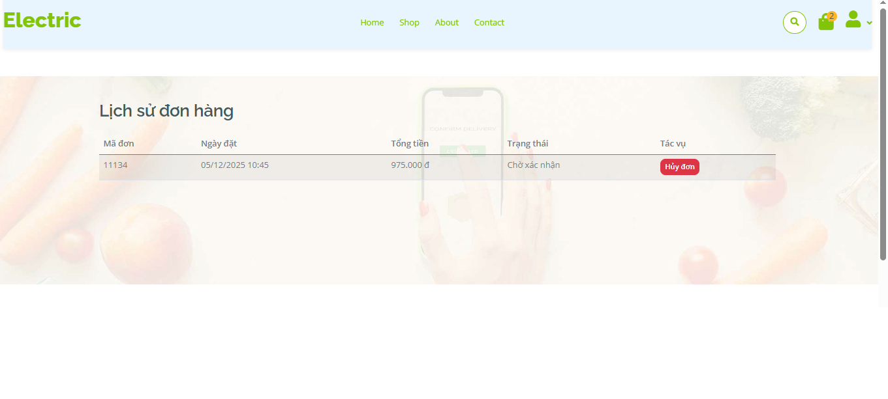
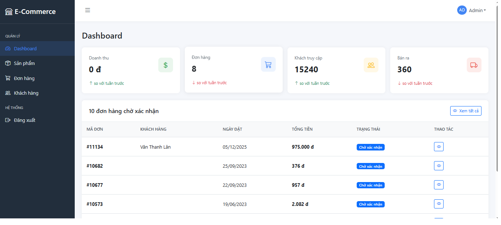
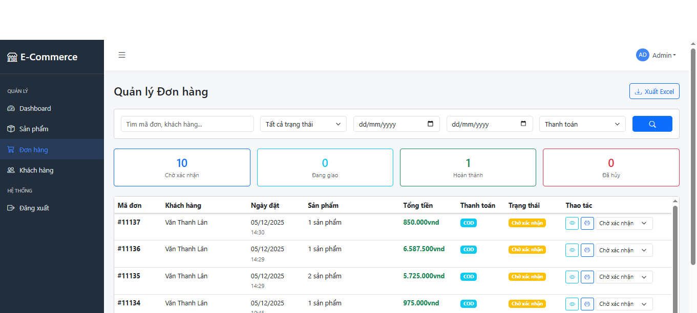
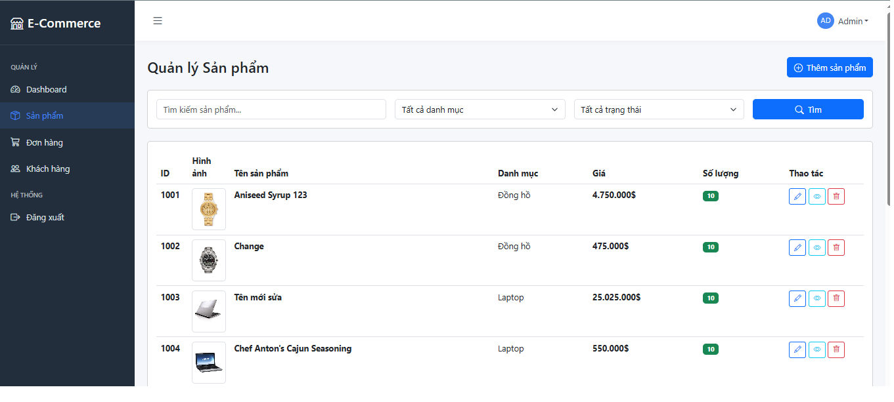
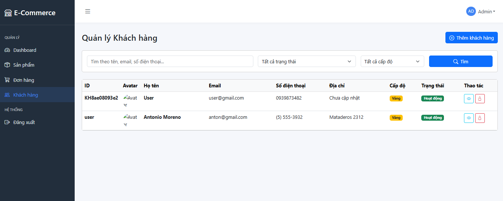

## Một số tính năng chính:
### Khách hàng:
##### -Đăng nhập, đăng ký
##### -Xem, tìm kiếm sản phẩm, thêm vào giỏ hàng
##### - Xem đơn hàng (có thể xem qua QRCode), hủy đơn hàng, chỉnh sửa thông tin cá nhân
##### - Thanh toán bằng Cod hoặc qua VNPay SanBox

### Admin:
##### - Thống kê doanh thu, đơn hàng ...
##### - Quản lý đơn hàng (xem, cập nhật trạng thái, in đơn hàng kèm mã QR)
##### - Quản lý khách hàng (xem, thêm, sửa, khóa và mở khóa tài khoản)
##### - Quản lý sản phẩm (xem, thêm, sửa, xóa)

## Một số config quan trọng
##### -Add thư viện QRCode vào project
##### -Khai báo các tham số như TmnCode, HashSecret, Url, ReturnUrl (địa chỉ localhost mà project đang chạy) của VNPay vào appsetting.json
##### -Khai báo OrderQrSecret bất kỳ để hash QRCode cho đơn hàng

## Một số giao diện
#### (Do mình custom lại template nên 1 số chỗ chưa kịp sửa, mong mng thông cảm :) )
##### Đăng Nhập

##### Home

##### Giỏ Hàng

##### Thanh Toán: nếu bạn chọn thanh toán bằng VnPay thì bạn có thể sử dụng 1 số trường hợp test ở link <https://sandbox.vnpayment.vn/apis/vnpay-demo/>

##### Lịch Sử Đơn Hàng

##### Dashboard

##### Quản Lý Đơn Hàng

##### Quản Lý Sản Phẩm

##### Quản Lý Khách Hàng

